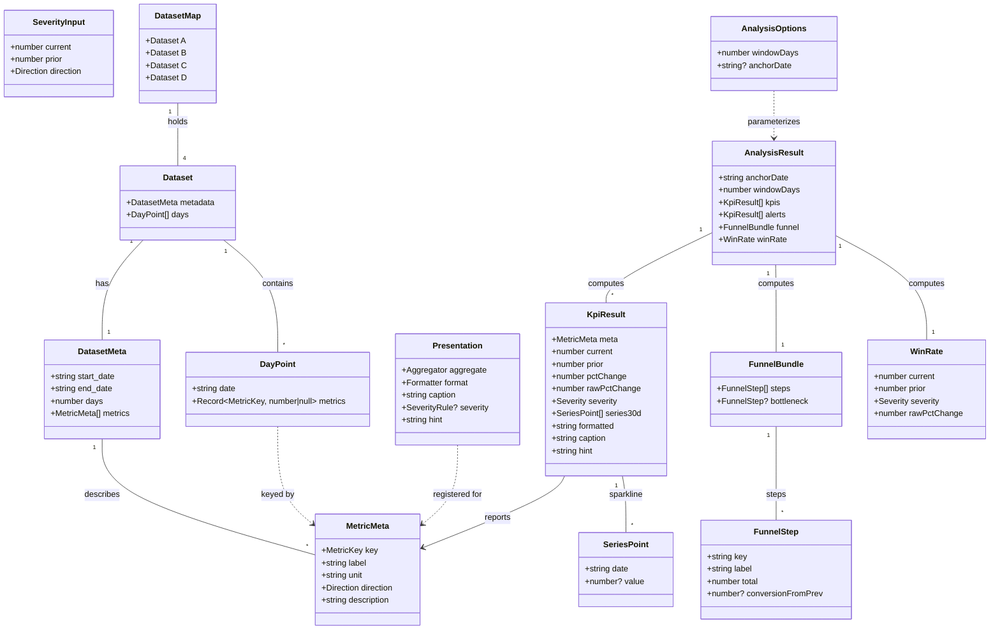

# Palvi Sales Cockpit — Executive Daily Report

## Requirements

Implement an executive sales dashboard for a Chilean B2B SaaS company that reads a bundled `metrics.json` containing four sibling datasets (`A`, `B`, `C`, `D`), surfaces the top severity-ranked items a Sales Manager should focus on today, and lets the user switch among datasets via the URL. The application MUST present every metric through a single per-metric presentation registry that owns aggregation, formatting, severity, and copy. The Sales Manager has roughly 5 minutes before standup; the dashboard's job is to answer "where do I focus today" without further interaction. The four datasets MUST produce visibly different output: a rotting pipeline (A) and a healthy one (C) cannot look the same.

Boundary: a single-page dashboard, client-side only, no authentication, no backend, no live data, no data export, no light theme, no automated test suite. Stack constraint per task brief: React + TypeScript.

Value: shorten daily decision-making for the Sales Manager from "scan eleven metrics and form an opinion" to "read the top three items and act".

## Entities

The DatasetMap is bundled at build time from `metrics.json`; everything downstream is derived. `Presentation` is the single switching surface — adding a metric is one row in the registry.

## Approach

1. Architectural layering:
   - **Domain layer** (`src/data/`, `src/domain/`) is pure TypeScript: types, loader, registry, analysis. No React, no DOM, no side effects beyond `import metrics.json`.
   - **UI layer** (`src/ui/`) consumes pure-domain outputs (`Presentation`, `KpiResult`, `AnalysisResult`) through props. No component imports the registry directly except for type purposes; the analysis pipeline is the seam.
   - **Composition root** (`src/App.tsx`) wires URL state → dataset selection → analysis → dashboard rendering.

2. Single source of truth for per-metric behavior:
   - The `REGISTRY: Record<MetricKey, Presentation>` in `src/domain/metric-registry.ts` is THE central abstraction. It defines, per metric, the aggregator function (mean ignoring nulls / last value / etc.), the formatter, the caption, an optional severity override, and a one-line hint.
   - Generic UI components (`KpiCard`) read `Presentation` and `KpiResult` and never branch on metric `key`. Adding a new metric is one row.

3. Severity model:
   - Default rule is direction-aware delta: `signed = (current - prior) / |prior|` flipped for `lower_is_better` metrics; thresholds at −5 % / −15 % / −30 % map to `OK / WATCH / ALERT / CRIT`.
   - Per-metric overrides exist for `stale_deals` (absolute thresholds 60/100/150) and `avg_response_time_min` (absolute thresholds 30/60/90 min). Override severity = `max(trendSeverity, absoluteSeverity)`.
   - `prior === 0` short-circuits to `OK` so an empty / null-only window does not trigger a false alert.

4. Analysis pipeline:
   - One pure function: `analyze(dataset: Dataset, opts: AnalysisOptions): AnalysisResult`.
   - Slices a current and a prior window of `windowDays` days anchored on the rightmost day in the dataset (or the optional `anchorDate`).
   - Walks the registry per metric to build a `KpiResult[]`.
   - Filters at WATCH+ and sorts by severity then `|pctChange|` to produce `alerts`.
   - Independently computes a 30-day funnel (sums of flow metrics, step-to-step conversions) and a period win rate (`sum(won) / sum(won + lost)`).

5. State management:
   - The selected dataset is the only piece of cross-component state and lives in the URL as `?dataset=A`.
   - A custom hook `useDatasetParam` reads on mount, pushes on change, and listens to `popstate` for back/forward.
   - No global store, no Context — `<Dashboard key={datasetId} dataset={dataset} />` remounts cleanly per dataset.

6. Visual approach:
   - Dark theme only. Tailwind 3 with extended color tokens (`bg`, `ink`, severity `ok`/`watch`/`alert`/`crit`, `accent`).
   - shadcn-style hand-rolled primitives (`Card`, `Tabs` via Radix, `Badge`) — three components, each <40 lines, kept under `src/ui/components/ui/`.
   - Recharts for sparklines (one `<AreaChart>` per KPI card) and the funnel (custom horizontal bar layout, no Recharts dep there).
   - Numbers use `font-variant-numeric: tabular-nums` so values align across cards.

7. Error handling:
   - The analysis pipeline assumes `dataset.days` is chronologically ordered and non-empty. The loader narrows `DatasetMap` against `metrics.json`'s shape.
   - URL parsing falls back to dataset `A` on any unknown value (`isDatasetId` type guard).
   - Recharts gracefully renders missing values via `connectNulls`.
   - No top-level error boundary in the MVP — documented as a second-iteration item.

8. Charting strategy:
   - Sparklines: Recharts `AreaChart` with severity-tinted gradient, no axes, no grid, fixed height (44 px).
   - Funnel: hand-rolled horizontal bars (Tailwind widths derived from totals) — no Recharts dependency for the funnel because the layout is too custom for the library's funnel chart.

## Structure

### Inheritance Relationships

1. `Severity` is a string-literal union (`'ok' | 'watch' | 'alert' | 'crit'`), not a class hierarchy. A constant `SEV_RANK: Record<Severity, number>` provides the order used for sorting and `max` composition.
2. `Direction` is a string-literal union (`'higher_is_better' | 'lower_is_better'`).
3. `DatasetId` is a string-literal union (`'A' | 'B' | 'C' | 'D'`).
4. `Aggregator`, `Formatter`, `SeverityRule` are function types (no inheritance, composition by passing functions).
5. UI primitives extend native HTML element prop types via `React.HTMLAttributes<HTMLDivElement>` etc.
6. There is no custom exception class hierarchy — TypeScript strictness and type guards eliminate the need.

### Dependencies

1. `App.tsx` imports `useDatasetParam`, `DatasetSwitcher`, `Dashboard`, `datasets` from the loader.
2. `Dashboard.tsx` imports `analyze` from `domain/analysis`, plus the four UI sections (`AlertList`, `KpiCard`, `Funnel`, `WinRatePill`).
3. `analyze` imports `getPresentation` and `deltaSeverity` from `domain/metric-registry`.
4. `metric-registry.ts` imports `Direction`, `MetricKey`, `Severity` from `data/types.ts` only — no UI imports.
5. `loader.ts` imports `metrics.json` and re-exports it typed as `DatasetMap`.
6. `KpiCard` imports `Card`, `Badge` from `ui/components/ui/`, `Sparkline` from `ui/components/`, `cn` from `lib/cn`, `severityX` from `ui/severity`.
7. `Sparkline` imports `recharts` (the only Recharts use).
8. `DatasetSwitcher` imports `Tabs`, `TabsList`, `TabsTrigger` (which wrap `@radix-ui/react-tabs`).
9. No component imports `metric-registry` directly; the registry lives behind `analyze()`.

### Layered Architecture

1. **Data layer** (`src/data/`):
   - `types.ts` — domain type unions and interfaces.
   - `loader.ts` — `import metricsJson from '../../metrics.json'`, exports typed `datasets: DatasetMap`, `DATASET_IDS`, `isDatasetId`.

2. **Domain layer** (`src/domain/`):
   - `metric-registry.ts` — `REGISTRY: Record<MetricKey, Presentation>`, default `deltaSeverity`, per-metric overrides (`staleDealsSeverity`, `responseTimeSeverity`), aggregators (`meanIgnoreNull`, `lastNonNull`), formatters (`int`, `dec1`).
   - `analysis.ts` — `analyze(dataset, opts) → AnalysisResult`. Pure.

3. **UI primitives** (`src/ui/components/ui/`):
   - `Card.tsx`, `CardHeader`, `CardTitle`, `CardContent`.
   - `Tabs.tsx` (Radix wrapper), `TabsList`, `TabsTrigger`.
   - `Badge.tsx` (severity-aware).

4. **UI components** (`src/ui/components/`):
   - `Sparkline.tsx` (Recharts).
   - `KpiCard.tsx` (consumes `KpiResult`).
   - `AlertList.tsx` (consumes `KpiResult[]`, top 3, with `explain()` per-metric copy).
   - `Funnel.tsx` (consumes `FunnelStep[]` + bottleneck).
   - `WinRatePill.tsx` (consumes `WinRate`).
   - `DatasetSwitcher.tsx` (consumes `DatasetId`, calls back).

5. **Composition layer** (`src/ui/`):
   - `Dashboard.tsx` — composes one `AnalysisResult` over four sections.
   - `useDatasetParam.ts` — URL-synchronized dataset state hook.
   - `severity.ts` — `severityHex`, `severityBg`, `severityDot`, `severityLabel` lookup tables.

6. **Library layer** (`src/lib/`):
   - `cn.ts` — `clsx` + `tailwind-merge` utility.

7. **App shell**: `App.tsx`, `main.tsx`, `index.css`, `index.html`.

8. **Build / config**: `vite.config.ts`, `tsconfig.json`, `tailwind.config.js`, `postcss.config.js`, `package.json`, `.gitignore`.

## Operations

### Create Type Module — `src/data/types.ts`

1. Responsibility: declare every domain type union and interface.
2. Exports:
   - `Direction` = `'higher_is_better' | 'lower_is_better'`
   - `Severity` = `'ok' | 'watch' | 'alert' | 'crit'`
   - `MetricKey` = `string` (alias)
   - `interface MetricMeta { key, label, unit, direction, description }`
   - `interface DayPoint { date: string; metrics: Record<MetricKey, number | null> }`
   - `interface DatasetMeta { start_date, end_date, days, metrics: MetricMeta[] }`
   - `interface Dataset { metadata: DatasetMeta; days: DayPoint[] }`
   - `type DatasetId = 'A' | 'B' | 'C' | 'D'`
   - `type DatasetMap = Record<DatasetId, Dataset>`
3. No values exported, only types.
4. Constraints: every union is closed (no `| string` escape hatches).

### Create Loader — `src/data/loader.ts`

1. Responsibility: bundle `metrics.json` and expose it typed.
2. Statements:
   - `import metricsJson from '../../metrics.json'`
   - `export const datasets = metricsJson as unknown as DatasetMap`
   - `export const DATASET_IDS: DatasetId[] = ['A', 'B', 'C', 'D']`
   - `export function isDatasetId(value: string | null | undefined): value is DatasetId { return !!value && (DATASET_IDS as string[]).includes(value) }`
3. Constraints: no runtime validation library; the BRD treats `metrics.json` as a known shape.

### Create Metric Registry — `src/domain/metric-registry.ts`

1. Responsibility: the single source of truth for HOW each metric is presented.
2. Internal types:
   - `type Aggregator = (values: (number | null)[]) => number`
   - `type Formatter = (value: number) => string`
   - `interface SeverityInput { current, prior, direction }`
   - `type SeverityRule = (input: SeverityInput) => Severity`
   - `interface Presentation { aggregate, format, caption, severity?, hint }`
3. Aggregators (private):
   - `meanIgnoreNull(xs)` → mean of non-null entries, or 0 if all null.
   - `lastNonNull(xs)` → rightmost non-null entry, or 0.
4. Formatters (private):
   - `int(n) = Math.round(n).toLocaleString('en-US')`
   - `dec1(n) = n.toFixed(1)`
5. `SEV_RANK: Record<Severity, number> = { ok: 0, watch: 1, alert: 2, crit: 3 }`
6. `maxSev(a, b): Severity = SEV_RANK[a] >= SEV_RANK[b] ? a : b`
7. Default severity rule:
   - `deltaSeverity({ current, prior, direction })`:
     - if `!Number.isFinite(prior) || prior === 0` → `'ok'`
     - `pctChange = (current - prior) / Math.abs(prior)`
     - `signed = direction === 'higher_is_better' ? pctChange : -pctChange`
     - return `'ok'` if `signed >= -0.05`, `'watch'` if `>= -0.15`, `'alert'` if `>= -0.30`, else `'crit'`.
8. Per-metric overrides:
   - `staleDealsSeverity(input)`: `maxSev(deltaSeverity(input), absSev)` where `absSev = current >= 150 ? 'crit' : current >= 100 ? 'alert' : current >= 60 ? 'watch' : 'ok'`.
   - `responseTimeSeverity(input)`: `maxSev(deltaSeverity(input), absSev)` where `absSev = current >= 90 ? 'crit' : current >= 60 ? 'alert' : current >= 30 ? 'watch' : 'ok'`.
9. `REGISTRY: Record<MetricKey, Presentation>` with one row per metric:
   - `traffic` → `meanIgnoreNull, int, '/d', no override, hint`
   - `leads_created`, `leads_qualified`, `deals_created`, `deals_won`, `deals_lost` → `meanIgnoreNull, dec1, '/d', no override`
   - `avg_response_time_min` → `meanIgnoreNull, dec1, 'min', responseTimeSeverity`
   - `avg_deal_cycle_days` → `meanIgnoreNull, dec1, 'days', no override`
   - `stale_deals` → `lastNonNull, int, 'open >60d', staleDealsSeverity`
   - `support_tickets_opened` → `meanIgnoreNull, dec1, '/d', no override`
   - `support_avg_resolution_hours` → `meanIgnoreNull, dec1, 'hr', no override`
10. `getPresentation(key)`: returns `REGISTRY[key]` or a fallback `{ meanIgnoreNull, dec1, '', undefined, '' }`.
11. Constraints: no React imports. No mutation of the REGISTRY at runtime.

### Create Analysis Pipeline — `src/domain/analysis.ts`

1. Responsibility: turn a `Dataset` + window options into a complete `AnalysisResult`.
2. Public types:
   - `interface KpiResult { meta, current, prior, pctChange, rawPctChange, severity, series30d, formatted, caption, hint }`
   - `interface FunnelStep { key, label, total, conversionFromPrev }`
   - `interface AnalysisOptions { windowDays?, anchorDate? }`
   - `interface AnalysisResult { anchorDate, windowDays, kpis, alerts, funnel: { steps, bottleneck }, winRate: { current, prior, severity, rawPctChange } }`
3. Private helpers:
   - `valuesFor(days, key)`: `days.map(d => d.metrics[key] ?? null)`.
   - `pctSigned(current, prior, direction)`: returns 0 if prior is 0/non-finite, else direction-aware signed change.
   - `rawPct(current, prior)`: returns 0 if prior is 0/non-finite, else `(current - prior) / |prior|`.
   - `safeDiv(n, d)`: `d > 0 ? n / d : 0`.
4. Main function `analyze(dataset, opts = {})`:
   - Logic:
     - `windowDays = opts.windowDays ?? 7`
     - `anchorIdx = opts.anchorDate ? days.findIndex(d.date === opts.anchorDate) : days.length - 1`
     - throw if `anchorIdx < 0`.
     - `curStart = max(0, anchorIdx - windowDays + 1)`, `curEnd = anchorIdx + 1`
     - `priorStart = max(0, curStart - windowDays)`, `priorEnd = curStart`
     - `sparkStart = max(0, anchorIdx - 29)`
     - For each `meta` in `dataset.metadata.metrics`:
       - `presentation = getPresentation(meta.key)`
       - `current = presentation.aggregate(valuesFor(curWindow, meta.key))`
       - `prior = presentation.aggregate(valuesFor(priorWindow, meta.key))`
       - `severity = (presentation.severity ?? deltaSeverity)({ current, prior, direction: meta.direction })`
       - `series30d = days.slice(sparkStart, anchorIdx + 1).map(d => ({ date: d.date, value: d.metrics[meta.key] }))`
       - Build a `KpiResult` with `formatted = presentation.format(current)`.
     - `alerts = kpis.filter(SEV_RANK[k.severity] >= SEV_RANK.watch).sort((a, b) => SEV_RANK[b.severity] - SEV_RANK[a.severity] || abs(b.pctChange) - abs(a.pctChange))`
     - Funnel:
       - `last30 = days.slice(sparkStart, anchorIdx + 1)`
       - `totalOf(key) = last30.reduce(sum of d.metrics[key] ?? 0)`
       - Steps in order: visits, leads, qualified, deals, won. First step has `conversionFromPrev = null`; subsequent steps use `safeDiv(step.total, prevStep.total)`.
       - `bottleneck = steps.slice(1).reduce((best, s) => s.conversionFromPrev != null && (best == null || best.conversionFromPrev > s.conversionFromPrev) ? s : best, null)`
     - Win rate:
       - `wrFor(window) = safeDiv(sum(won), sum(won) + sum(lost))`
       - `wrCur = wrFor(curWindow)`, `wrPrior = wrFor(priorWindow)`
       - `wrSev = deltaSeverity({ current: wrCur, prior: wrPrior, direction: 'higher_is_better' })`
   - Return: `{ anchorDate, windowDays, kpis, alerts, funnel, winRate }`.
5. Constraints: pure function. No `Date` arithmetic — work on indices into `days[]` only.

### Create Severity Lookup — `src/ui/severity.ts`

1. Responsibility: severity → visual mapping in one file.
2. Exports:
   - `severityHex: Record<Severity, string>` — `ok='#10b981', watch='#f59e0b', alert='#fb923c', crit='#ef4444'`.
   - `severityLabel: Record<Severity, string>` — `OK`, `Watch`, `Alert`, `Critical`.
   - `severityBg: Record<Severity, string>` — Tailwind class triplet `bg-{c}/15 text-{c} border-{c}/30`.
   - `severityDot: Record<Severity, string>` — Tailwind `bg-{c}`.
3. Constraints: no React, no DOM.

### Create Class-Name Helper — `src/lib/cn.ts`

1. Responsibility: combine `clsx` and `tailwind-merge`.
2. `export function cn(...inputs: ClassValue[]) { return twMerge(clsx(inputs)) }`.

### Create Card Primitives — `src/ui/components/ui/Card.tsx`

1. Responsibility: minimal shadcn-style card.
2. Components: `Card` (forwardRef on a div with class `surface ...`), `CardHeader`, `CardTitle`, `CardContent`. All accept `HTMLAttributes` and merge via `cn`.

### Create Tabs Primitives — `src/ui/components/ui/Tabs.tsx`

1. Responsibility: dark-themed Radix Tabs wrapper.
2. Re-exports: `Tabs = TabsPrimitive.Root`. `TabsList` and `TabsTrigger` are forwardRefs styling Radix primitives via `cn`.
3. Active state: `data-[state=active]:bg-bg-card data-[state=active]:text-ink` plus a subtle accent ring.

### Create Badge — `src/ui/components/ui/Badge.tsx`

1. Responsibility: severity-aware pill.
2. Props: `severity?: Severity`, plus `HTMLAttributes<HTMLSpanElement>`.
3. If `severity` is set, classes come from `severityBg[severity]` and the default text is `severityLabel[severity]`. Children override.

### Create Sparkline — `src/ui/components/Sparkline.tsx`

1. Responsibility: one severity-tinted area chart, fixed height, no axes.
2. Props: `data: { date, value: number | null }[]`, `severity?: Severity = 'ok'`, `height?: number = 44`.
3. Logic:
   - If every `value` is null, render `
no data
`.
   - Otherwise, render Recharts `<ResponsiveContainer><AreaChart>` with a linear gradient defined per severity (`stop offset 0% opacity .45`, `100% opacity 0`), `Area type="monotone" stroke=severityHex[s] strokeWidth=1.75 connectNulls dot={false} activeDot={false} isAnimationActive={false}`.
4. Constraints: explicit height; never rely on flex.

### Create KpiCard — `src/ui/components/KpiCard.tsx`

1. Responsibility: render one `KpiResult` as a card.
2. Props: `{ kpi: KpiResult }`.
3. Layout:
   - Header: `meta.label` + tiny `hint` line; severity Badge on the right when `severity !== 'ok'`.
   - Body: big `formatted` number + small `caption`; sparkline (severity-tinted, full width); footer with delta arrow + sign + pct + "vs prior 7d".
4. Logic:
   - `arrow = rawPctChange === 0 ? '→' : rawPctChange > 0 ? '▲' : '▼'`
   - `isGood = pctChange >= 0`
   - `deltaColor = pctChange === 0 ? 'text-ink-faint' : isGood ? 'text-ok' : 'text-alert'`
   - `pct = (Math.abs(rawPctChange) * 100).toFixed(1)`
   - `sign = rawPctChange > 0 ? '+' : rawPctChange < 0 ? '−' : ''`
5. Card border: subtle severity ring on watch/alert/crit (`ring-1` + severity-tinted ring color).

### Create AlertList — `src/ui/components/AlertList.tsx`

1. Responsibility: ranked top-3 alerts with per-metric explanatory copy.
2. Props: `{ alerts: KpiResult[]; limit?: number = 3; emptyMessage?: string }`.
3. Per-metric copy via local helper `explain(k: KpiResult): string`:
   - `stale_deals`: `"<n> deals open >60 days (<sign><pct>% vs prior week). Push these to close or kill them."`
   - `avg_response_time_min`: `"Sales takes <n> min to first-touch leads (<sign><pct>%). Slow response kills B2B conversion."`
   - `avg_deal_cycle_days`: `"Deals taking <n> days to close (<sign><pct>%). Cycle is dragging."`
   - `deals_lost`: `"Losing <n> /d (<sign><pct>%). Review qualification and pricing."`
   - `deals_won`: `"Closing <n> /d, <sign><pct>% vs prior — wins falling."`
   - `support_tickets_opened`: `"<n> /d new tickets (<sign><pct>%). Volume spike may pull capacity."`
   - default: `"<label> at <formatted> <caption> (<sign><pct>% vs prior, should go up/down)."`
4. Layout:
   - Card with header "Tu foco hoy" + subline "ranked by severity · last 7d vs prior 7d".
   - If `alerts` is empty after slicing → render `emptyMessage` in OK color.
   - Otherwise list 3 items: severity dot + uppercase severity label + metric label + explanation.

### Create Funnel — `src/ui/components/Funnel.tsx`

1. Responsibility: horizontal bar chart of `FunnelStep[]` with bottleneck highlight.
2. Props: `{ steps: FunnelStep[]; bottleneck: FunnelStep | null }`.
3. Layout: 4-col grid per row — `[label] [bar] [total] [conversion %]`.
4. Bar width: `Math.max(step.total / max * 100, 1)%` where `max = max(step.total)`.
5. Bottleneck row gets `bg-alert/60` instead of `bg-accent/55`; the conversion text is alert-colored. Header shows `cuello: <bottleneck.label>` when present.
6. First step's conversion column shows `—`.

### Create WinRatePill — `src/ui/components/WinRatePill.tsx`

1. Responsibility: small severity-colored pill in the dashboard header.
2. Props: `{ current, prior, severity, rawPctChange }`.
3. Render: `Win rate · <pct>% · ▲/▼ from <priorPct>%`, all inside a single span styled by `severityBg[severity]`.

### Create DatasetSwitcher — `src/ui/components/DatasetSwitcher.tsx`

1. Responsibility: A/B/C/D segmented control.
2. Props: `{ value: DatasetId; onChange: (id: DatasetId) => void }`.
3. Render: Radix `Tabs` with one `TabsTrigger` per `DATASET_IDS` entry; `onValueChange` casts to `DatasetId`.

### Create URL Hook — `src/ui/useDatasetParam.ts`

1. Responsibility: keep `?dataset=A` in sync with React state.
2. Implementation:
   - `read()`: parse `window.location.search`; if `isDatasetId(v)` return `v`, else `'A'`.
   - `useState<DatasetId>(read)`.
   - `useEffect` registers a `popstate` listener that resets state to `read()`.
   - `update(next)`: `setId(next)`, then `pushState({}, '', new URL with searchParams.set('dataset', next))`.
   - Returns `[id, update]`.
3. Constraints: SSR-safe (`typeof window === 'undefined'` early return in `read`).

### Create Dashboard — `src/ui/Dashboard.tsx`

1. Responsibility: compose one `AnalysisResult` over the visual sections.
2. Props: `{ dataset: Dataset }`.
3. Logic:
   - `analysis = useMemo(() => analyze(dataset, { windowDays: 7 }), [dataset])`
   - Header row: anchor date (formatted with `Intl.DateTimeFormat` `es-CL`), window text, `WinRatePill` on the right.
   - `<AlertList alerts={analysis.alerts} />`
   - `
` with one `<KpiCard key={kpi.meta.key} kpi={kpi} />` per `analysis.kpis`.
   - `<Funnel steps={analysis.funnel.steps} bottleneck={analysis.funnel.bottleneck} />`

### Create App Shell — `src/App.tsx`, `src/main.tsx`, `src/index.css`

1. `App.tsx`:
   - `const [datasetId, setDatasetId] = useDatasetParam()`
   - `const dataset = datasets[datasetId]`
   - Render header (logo + title + `DatasetSwitcher`), `<main>` with `<Dashboard key={datasetId} dataset={dataset} />`, footer pointing readers at `src/domain/metric-registry.ts`.
2. `main.tsx`: standard React 18 root.
3. `index.css`: Tailwind directives + `@layer components` for `.surface` (card surface) and `.num` (tabular numerals).

### Create Build Configuration

1. `package.json` with deps:
   - prod: `react@18`, `react-dom@18`, `@radix-ui/react-tabs`, `recharts`, `clsx`, `tailwind-merge`.
   - dev: `vite`, `@vitejs/plugin-react`, `typescript`, `@types/react`, `@types/react-dom`, `@types/node`, `tailwindcss`, `postcss`, `autoprefixer`.
   - scripts: `dev`, `build = tsc --noEmit && vite build`, `preview`, `typecheck`.
2. `vite.config.ts`: React plugin + `resolve.alias['@'] = src`.
3. `tsconfig.json`: strict, target ES2022, JSX `react-jsx`, `paths: { '@/*': ['src/*'] }`.
4. `tailwind.config.js`: `darkMode: 'class'`, content `['./index.html', './src/**/*.{ts,tsx}']`, theme extends with severity + ink + bg color tokens.
5. `postcss.config.js`: tailwindcss + autoprefixer.
6. `index.html`: `<html lang="es" class="dark">`, Inter font from `rsms.me`, `
`.
7. `.gitignore`: `node_modules`, `dist`, `.DS_Store`, `*.log`, `.env*`.

### Verify and Document

1. `npm install`.
2. `npm run typecheck` — must exit 0.
3. `npm run dev`, verify at `http://localhost:5173/?dataset=A` (and B, C, D). Use a headless screenshot if no live browser available.
4. Spot-check AC2 visually: dataset A shows multiple non-OK badges and a CRIT in the hero; dataset C shows mostly OK, no CRIT.
5. Write `README.md` (one page max, two sections):
   - **Decisiones técnicas**: registry as single switching surface, hybrid severity, URL state, bundled JSON, dark-only, 30-day funnel, Tabs over dropdown.
   - **Segunda iteración**: error boundary, automated tests per metric, configurable window, CSV/PDF export, light theme, fetched JSON with skeleton, em-dash on all-null windows.
6. Commit work in atomic chunks: scaffold, domain, UI, app, README.

## Norms

1. **TypeScript discipline**: `strict: true`, `noUnusedLocals`, `noUnusedParameters`. No `any`. No `as` casts except at the JSON loader boundary (`as unknown as DatasetMap`).
2. **ESM + named exports** everywhere except React components (default export of the page-level component is fine when there is exactly one).
3. **Path alias**: import from `@/...` for everything under `src/`. Relative imports only inside the same directory.
4. **No metric-key branching outside the registry**: every `switch (key)` in components is a code smell. Exception: `AlertList.explain()` (per-metric copy is a presentation concern, not a domain concern).
5. **Pure domain layer**: `src/data/` and `src/domain/` MUST NOT import from `react`, `react-dom`, `@radix-ui/*`, or `recharts`.
6. **React component file conventions**: PascalCase filenames (`KpiCard.tsx`), one component per file. Hooks live in their own files (`useDatasetParam.ts`).
7. **Tailwind class composition**: always go through `cn(...)`. Never concatenate strings manually.
8. **Severity visual tokens**: only `src/ui/severity.ts` defines severity → color/text. Components import from that table; no hex literals scattered across UI files.
9. **Numbers**: always render via the registry's `format` for KPIs. Manual `toFixed` is reserved for the small handful of derived ratios (delta, win rate).
10. **Dates**: `Intl.DateTimeFormat('es-CL', ...)`. No date library.
11. **Spanish UI chrome / English metric labels**: hero headline ("Tu foco hoy"), funnel header ("Embudo · últimos 30 días"), window line ("ventana 7d vs 7d previos") in Spanish. Metric labels and units come from `metrics.json` and stay English.
12. **Logging**: none in MVP. No `console.*` in committed code.
13. **Error handling**: trust the `metrics.json` shape at the loader boundary. Type guards (`isDatasetId`) handle URL inputs. No try/catch in domain layer.
14. **Comments**: only on the registry and analysis files, explaining WHY (snapshot vs. flow, direction inversion). UI components are self-documenting.
15. **Memoization**: `useMemo` only on `analyze(dataset, opts)`. Do NOT memoize sub-results; the cost is dominated by the analysis pass.
16. **Component size**: <120 lines per file. If a component grows past that, split.
17. **No global state library**: useState + URL only for the MVP.
18. **No router**: a single page; URL is read directly.

## Safeguards

1. **Functional constraints**:
   - Switching dataset MUST update every visible metric, alert, sparkline, funnel bar, and win-rate value within one render commit.
   - Hero MUST show at most 3 items; when zero items qualify, MUST render an explicit "no alerts" state.
   - Datasets `A` and `C` MUST produce visibly different hero output (different items, or different severity tiers, or both).
   - Every KPI card MUST render: label, hint, value, caption, sparkline, delta arrow + signed pct, severity badge when not OK.
   - Funnel MUST render all five steps and MUST highlight one of `leads | qualified | deals | won` as the bottleneck unless the dataset is fully empty.
2. **Performance constraints**:
   - Initial render under 1 s for the full 365-day, 4-dataset bundle on a typical laptop (target Lighthouse "First Contentful Paint" under 1.0 s in dev).
   - Dataset switch perceived as instant (< 300 ms from click to repaint).
   - Bundle size: prod build under 600 KB gzipped excluding the bundled `metrics.json` (which adds ~100 KB gzipped).
3. **Security constraints**:
   - No user input is ever interpolated into the DOM as HTML. React's default escaping handles every text node.
   - The URL `?dataset` parameter is type-narrowed via `isDatasetId`; bad values silently fall back to `A`.
   - No remote calls; no secrets to leak.
4. **Integration constraints**:
   - Modern evergreen browsers only (Chrome / Safari / Firefox current). No IE / legacy Edge testing.
   - Recharts version pinned to `^2.13.x`. Radix Tabs pinned to `^1.1.x`.
5. **Business rule constraints**:
   - Win rate is `sum(deals_won) / sum(deals_won + deals_lost)` over the window. Implementing it as a per-day mean is forbidden.
   - `stale_deals` aggregation is the latest non-null value in the window; summing is forbidden.
   - Direction inversion lives in exactly one place (`deltaSeverity`'s `signed` line); UI components do not reinvent it.
   - Severity composition is `max(trendSeverity, absoluteSeverity)`; minimum or average compositions are forbidden.
   - Hero filters at WATCH or worse and ranks by severity then `|pctChange|`. Other ranking strategies are forbidden in the MVP.
   - Funnel uses a 30-day window. The 7-day comparison window MUST NOT bleed into funnel computations.
6. **Exception handling constraints**:
   - The analysis pipeline assumes `dataset.days.length > 0`; an empty dataset would throw on `anchorIdx`. Loader is responsible for never producing an empty dataset.
   - URL parsing MUST NOT throw; bad values fall back to `A`.
   - No error boundary in the MVP; documented as second-iteration item.
7. **Technical constraints**:
   - Stack: Vite 5 + React 18 + TypeScript 5 strict.
   - Charting: Recharts only (no D3, no visx, no Chart.js).
   - Styling: Tailwind 3 only (no CSS modules, no styled-components, no emotion).
   - State: `useState` + URL only (no Zustand, no Redux, no Context).
   - Testing: deferred. Domain layer kept pure precisely so tests can be added later without UI refactors.
8. **Data constraints**:
   - `metrics.json` is committed to the repo and bundled at build time. The loader does not validate it at runtime.
   - All metric values are either `number` or `null`. Aggregators MUST treat `null` as "no signal", not as zero.
   - `dataset.days` is assumed chronologically ordered. Disordered input is undefined behavior.
9. **API constraints**:
   - There is no HTTP API in the MVP. The "API" of the app is one URL (`/`) with one query parameter (`?dataset=A`).
   - Inter-component contracts are TypeScript types in `src/data/types.ts` and `src/domain/analysis.ts`. Breaking those types in a follow-up requires updating every consumer.
10. **Accessibility constraints**:
    - Severity is conveyed through at least two channels: color + badge label, or color + dot. Color alone is forbidden.
    - Tabs are keyboard-navigable (Radix handles this).
    - Numeric values use `font-variant-numeric: tabular-nums` so values align across cards regardless of digit width.
    - Page language is `es` (`<html lang="es">`).
11. **Internationalization constraints**:
    - UI chrome strings are Spanish (Chilean register).
    - Metric labels and unit captions stay English (they ship that way in `metrics.json`).
12. **Deferred items (out of scope, do NOT implement)**:
    - Backend / API integration.
    - Auth, multi-tenant.
    - User-controlled window or anchor-day picker.
    - Side-by-side dataset comparison.
    - Per-metric drill-down view.
    - CSV / PDF / image export.
    - UI for tuning severity thresholds.
    - Light / system theme.
    - Automated test suite.
    - Server-side computation or caching.
    - Real-time updates.
